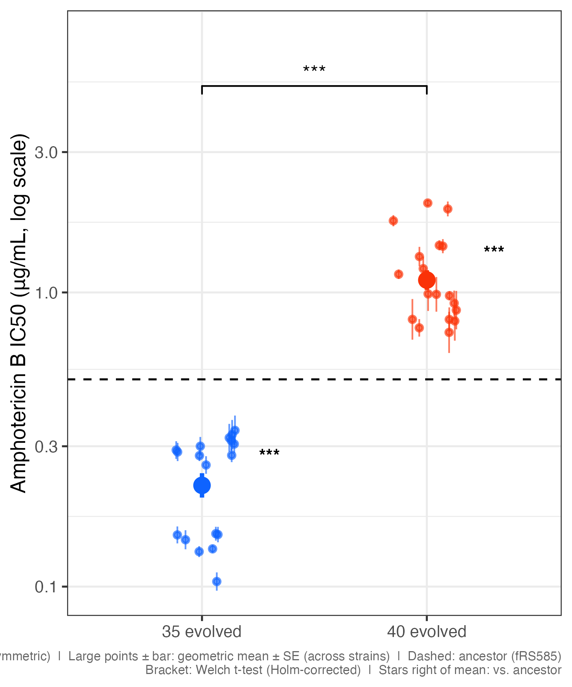
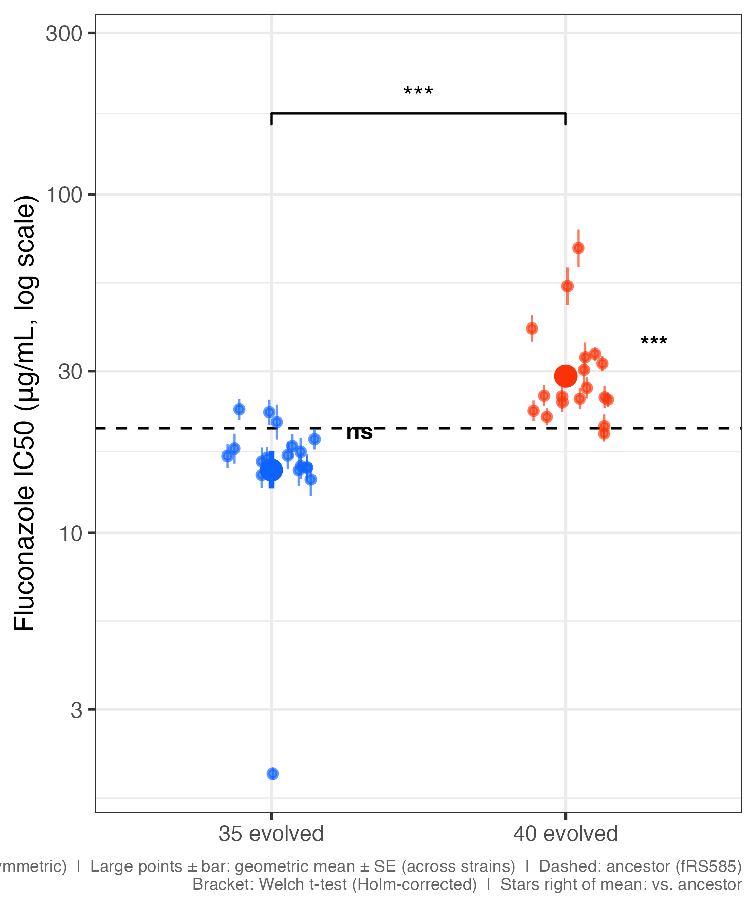
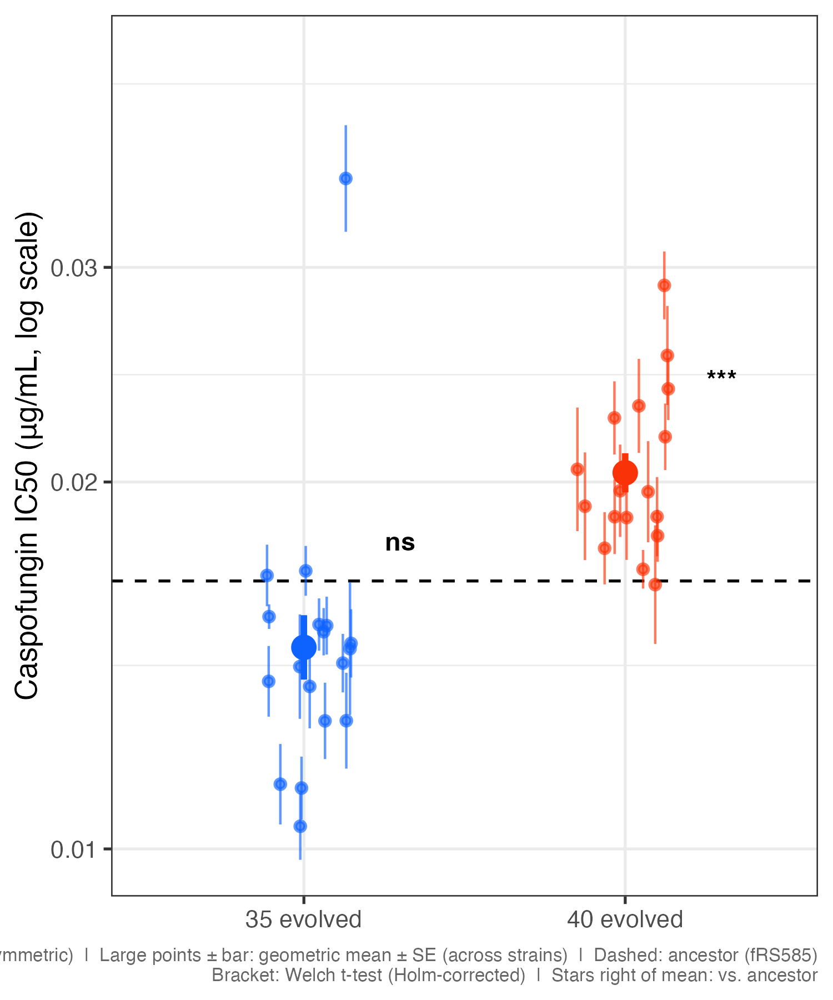
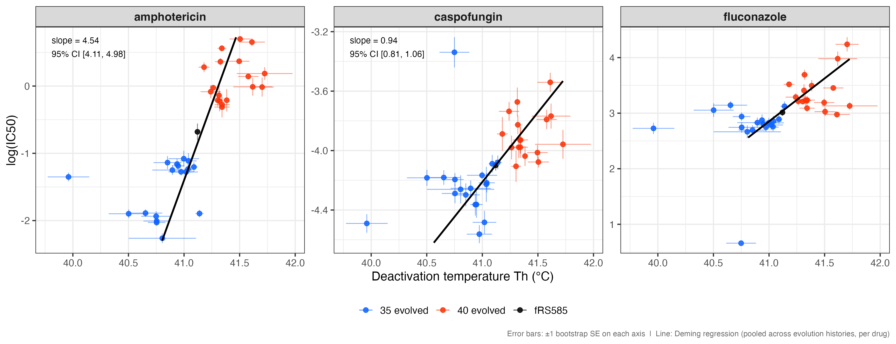
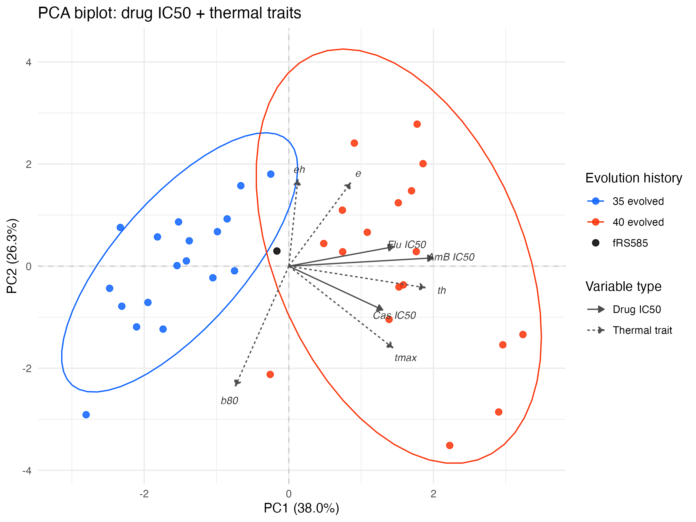

# Evidence for Cross-Tolerance: Thermal Adaptation and Drug IC50

*Analysis date: 1 July 2026*

---

## Background

Cross-tolerance refers to the phenomenon where adaptation to one stressor confers
altered tolerance to a different stressor. Here we test whether yeast strains that
evolved at high temperature (35°C or 40°C) show altered tolerance to antifungal
drugs — specifically amphotericin B (AmB), fluconazole (Flu), and caspofungin (Cas).
The core mechanistic hypothesis is that thermal adaptation remodels membrane
composition (particularly ergosterol content and saturation), and that these same
membrane changes affect antifungal drug binding.

The analysis uses 37 strains: 18 evolved at 35°C, 18 evolved at 40°C, and the
common ancestor fRS585 (n = 1, used as a reference). Key variables are the thermal
performance curve (TPC) parameters from Sharpe–Schoolfield High (SSH) model fits —
particularly the deactivation half-saturation temperature **Th** — and the IC50s
from pooled dose–response fits with 1,000 residual bootstrap iterations per strain.

---

## 1. Thermal trait shifts across evolution history groups

Before asking whether thermal traits predict drug tolerance, we confirm that the
evolved groups have shifted meaningfully in thermal performance relative to the
ancestor (fRS585). All tests are Welch two-sample t-tests (between groups) or
one-sample t-tests (vs. ancestor), Holm-corrected within each trait.

| Trait | 35-evolved vs ancestor | 40-evolved vs ancestor | 35 vs 40 evolved |
|-------|------------------------|------------------------|------------------|
| Topt  | −0.65°C, p = 0.001     | +0.07°C, ns            | −0.72°C [−1.09, −0.35], p = 0.001 |
| Tmax  | +0.07°C, ns            | +0.55°C, p = 0.005     | −0.48°C [−0.81, −0.16], p = 0.011 |
| Th    | −0.28°C, p < 0.001     | +0.30°C, p < 0.001     | −0.58°C [−0.74, −0.43], p < 0.001 |
| B80   | ns                     | ns                     | ns |

The two groups show **divergent trajectories**: the 35-evolved group shifted Topt
downward without changing Tmax, while the 40-evolved group maintained Topt near the
ancestral value but elevated Tmax and Th. Both groups shifted Th in opposite
directions — 35-evolved strains have lower deactivation temperatures, 40-evolved
strains have higher ones.

---

## 2. Between-group drug tolerance

### 2a. IC50 differences between evolved groups

The 40-evolved group has significantly higher IC50s than the 35-evolved group for
all three drugs (Welch t-tests on log-IC50, Holm-corrected across drugs):

| Drug | 35-evolved GM IC50 | 40-evolved GM IC50 | Fold difference | Δ log(IC50) [95% CI] | p (Holm) |
|------|-------------------|-------------------|-----------------|----------------------|----------|
| Amphotericin B | 0.221 µg/mL | 1.10 µg/mL | 5.0× | −1.61 [−1.86, −1.36] | < 0.001 |
| Fluconazole    | 15.3 µg/mL  | 29.0 µg/mL | 1.9× | −0.64 [−0.94, −0.34] | < 0.001 |
| Caspofungin    | 0.015 µg/mL | 0.020 µg/mL | 1.4× | −0.33 [−0.48, −0.18] | < 0.001 |

*GM = geometric mean; fold difference = 40-evolved / 35-evolved; Δ is 35 minus 40 (negative = 35 lower).*

The effect is largest for amphotericin (5-fold), moderate for fluconazole (1.9-fold),
and smallest for caspofungin (1.4-fold).

### 2b. Comparison to the ancestor (fRS585)

Relative to the ancestor (IC50: AmB = 0.506 µg/mL, Flu = 20.4 µg/mL,
Cas = 0.017 µg/mL), the two groups shifted in opposite directions — mirroring the
divergent thermal trait trajectories described in section 1:

| Drug | 35-evolved vs ancestor | 40-evolved vs ancestor |
|------|------------------------|------------------------|
| Amphotericin B | 2.3× lower, p < 0.001 | 2.2× higher, p < 0.001 |
| Fluconazole    | 1.3× lower, p = 0.076 (ns) | 1.4× higher, p < 0.001 |
| Caspofungin    | 1.1× lower, p = 0.076 (ns) | 1.2× higher, p < 0.001 |

For amphotericin, both groups diverged significantly from the ancestor — 35-evolved
became more sensitive and 40-evolved became more resistant. For fluconazole and
caspofungin, only the 40-evolved group moved significantly, with 35-evolved remaining
near the ancestral level.

### 2c. Caveat: between-group comparisons are confounded

These between-group IC50 differences are consistent with cross-tolerance but cannot
establish it on their own. The two groups differ in many unmeasured ways as a
consequence of selection at different temperatures, not only in their thermal traits.
A positive between-group correlation between Th and IC50 could arise even if there
were no within-group relationship — the same ecological fallacy that can inflate
pooled correlations and PCA loadings. The within-group analyses in sections 3 and 4
address this directly.

---

## 3. Within-group evidence: Deming regression (main result)

To test cross-tolerance at the individual-strain level — independent of which
temperature regime a strain evolved under — we group-mean centred both Th (°C) and
log(IC50) within each evolution history group before fitting Deming regression. This
removes the between-group shift from both axes, leaving only within-group
covariation. Deming regression is used rather than ordinary least squares because
both variables carry measurement error (quantified as bootstrap standard errors from
1,000 residual bootstrap iterations per strain/drug).

**Result: the within-group relationship is positive and highly significant for all
three drugs.**

| Drug | Slope (log IC50 / °C Th) | 95% CI | p |
|------|--------------------------|--------|---|
| Amphotericin B | 3.40 | [2.99, 3.82] | 8.2 × 10⁻¹⁸ |
| Fluconazole    | 2.45 | [2.12, 2.79] | 3.7 × 10⁻¹⁶ |
| Caspofungin    | 1.05 | [0.85, 1.26] | 7.1 × 10⁻¹² |

The slope is interpreted as: for each 1°C increase in Th above a strain's group
mean, its log(IC50) is predicted to increase by the given amount. Over a typical
within-group range of ±0.5 SD in Th (~±0.14°C), this corresponds to approximately
a 1.6× difference in amphotericin IC50 and a 1.4× difference in fluconazole IC50
between strains at the extremes of their group's Th distribution.

This relationship holds within groups, not just across them, providing direct
evidence that individual strains with higher deactivation temperatures are also more
drug tolerant — independent of their evolutionary background.

For reference, the pooled (uncentred) Deming regression is shown below. The steeper slopes reflect the additional between-group separation contributing to the apparent relationship.

---

## 4. Within-group PCA (corroborating multivariate evidence)

A standard (pooled) PCA on the 8-variable space (3 log-IC50s + e, eh, Th, B80,
Tmax) explains 38.0% on PC1 and 26.3% on PC2. Because the 35-evolved and
40-evolved groups are separated in both thermal and drug trait space, PC1 is
dominated by between-group separation — the between-group signal inflates the
apparent covariation between thermal and drug variables.

After group-mean centring all 8 variables before PCA, variance is more evenly
distributed (PC1 = 30.8%, PC2 = 24.0%; PC1 + PC2 = 54.8% vs. 64.3% pooled), and
the two group ellipses substantially overlap as expected.

In the centred biplot:

- **Amphotericin and fluconazole IC50s load together on PC2**, in a direction shared
  with the thermal trait *e* (activation energy) and Tmax. This suggests a common
  within-group source of variation linking these two drug tolerances with the thermal
  performance curve shape.
- **Caspofungin IC50 loads separately** on PC1, roughly orthogonal to the AmB/Flu
  cluster. Caspofungin targets the cell wall (β-glucan synthase), not the membrane,
  so it is biologically coherent that its cross-tolerance pattern is decoupled from
  the membrane-acting drugs.
- **Th has a short loading arrow** in the centred PCA, consistent with the earlier
  finding that Th varies only ~0.3°C SD within groups — it does not drive any
  within-group PCA axis strongly, even though the Deming regression shows it is
  reliably associated with drug IC50.

For reference, the standard pooled biplot (without centring) is shown below. PC1 is dominated by the between-group shift.

---

## 5. Mechanistic interpretation

Amphotericin B binds ergosterol directly; fluconazole inhibits ergosterol
biosynthesis. Both drugs' effectiveness therefore depends on membrane ergosterol
content. Thermal adaptation is known to involve membrane restructuring — including
changes in ergosterol content and fatty acid saturation — to maintain membrane
fluidity at higher temperatures. A membrane that is more ergosterol-rich or has a
different lipid composition to cope with heat stress may simultaneously present a
different target profile for membrane-acting antifungals. This provides a plausible
single-mechanism explanation for why AmB and Flu cross-tolerance co-vary.

Caspofungin's anomalous pattern (positive within-group slope in Deming regression,
but loading dissociated from AmB/Flu in the centred PCA) may reflect a weaker or
mechanistically distinct cross-tolerance pathway through cell wall remodelling
responses to heat stress, rather than membrane composition *per se*.

---

## 6. Caveats

- All analyses are **correlational**. Covariation between Th and drug IC50 is
  consistent with cross-tolerance but does not rule out a common upstream cause
  (e.g., a regulatory change that independently affects both membrane composition
  and drug efflux).
- fRS585 (n = 1) is a reference point only, not a testable group. Its values are
  used as a fixed µ₀ in one-sample t-tests, not as a sample.
- The Deming regression p-values use df = n − 2 = 35. Group-mean centring removes
  one degree of freedom per group (3 groups including fRS585 if present), so the
  effective df is ~33. This minor adjustment does not change any conclusions.
- Within-group Th variation is small (~0.3–0.5°C SD), making the Deming slope
  estimates steep but the practical effect size per typical strain moderate
  (~1.4–1.6× IC50 over ±1 within-group SD of Th).
